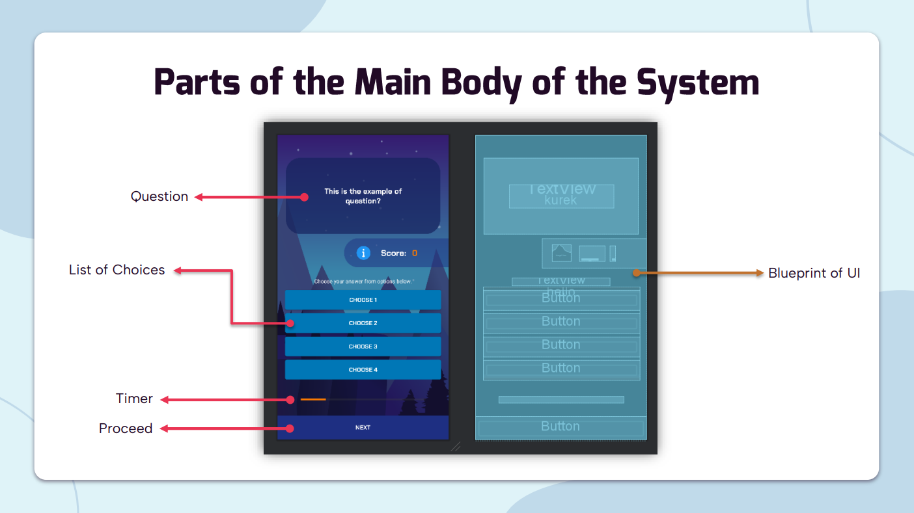
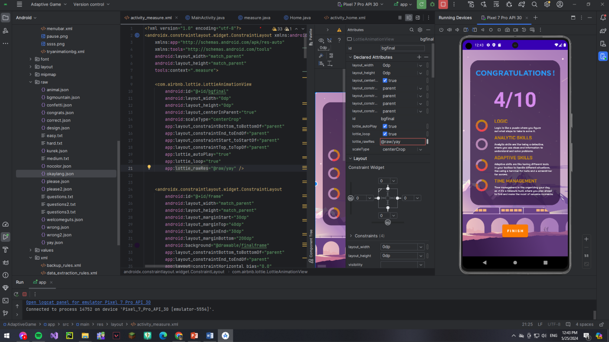
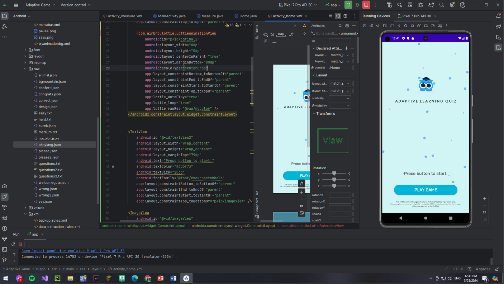

# 📱 Adaptive Learning Game for Kids using Android Studio
This application is an Android educational game built with **Android Studio**, designed to help children develop cognitive skills through interactive quizzes that adapt in real time.

The game implements a **linear adaptive algorithm** — the difficulty of questions increases when the user answers consistently correctly, and decreases when they struggle. The game syncs data with a local backend using **XAMPP** for storage and tracking.

---

## 🧠 Key Features

- 📊 **Linear Adaptive Algorithm** – Adjusts difficulty based on the user's performance.
- 👶 **Child-Friendly Design** – Simple, colorful UI optimized for young learners.
- 🔁 **Question Progression** – Questions become harder after 3 correct answers, easier after 2 incorrect.
- 🌐 **Backend with XAMPP** – Stores user progress, scores, and question sets using PHP + MySQL.
- 🧩 **Interactive Gameplay** – Designed for both learning and fun.

---

## 🖼️ Screenshots

### 🟢 Gameplay Layout

### 🟡 Score 

### 🔵 Welcome Page 

---

## 🛠️ Tech Stack

- **Frontend:** Android (Java/Kotlin via Android Studio)
- **Backend:** XAMPP (PHP, MySQL)
- **Database:** JSON file
- **Data Communication:** HTTP requests (Retrofit / Volley / Native APIs)

---

## 📚 How the Adaptive Algorithm Works

The game uses a **linear progression algorithm**:
- If the user gets **3 consecutive questions correct**, the game presents a more difficult question.
- If the user gets **2 incorrect in a row**, the game reduces the difficulty.
- Difficulty levels are mapped to question pools categorized by level.

This ensures learners are constantly challenged at the right level.

---

## 🚀 How to Run

### 📱 Android App

1. Open the project in **Android Studio**.
2. Connect a device or emulator.
3. Build and run the app (`Shift+F10`).

### 🖥️ XAMPP Backend

1. Start **Apache** and **MySQL** via XAMPP Control Panel.
2. Import the provided `.sql` file into **phpMyAdmin**.
3. Place the PHP API files into `htdocs/e-guess-api/`.

---

## ✏️ Developer Notes

- Created as part of a capstone project on **adaptive educational systems**.
- Designed with accessibility and engagement in mind for children aged 6–12.
- Modular structure makes it easy to extend with new question categories.

---

## 📄 License

This project is proprietary for educational use. Contact the author for collaboration or demo access.

---

